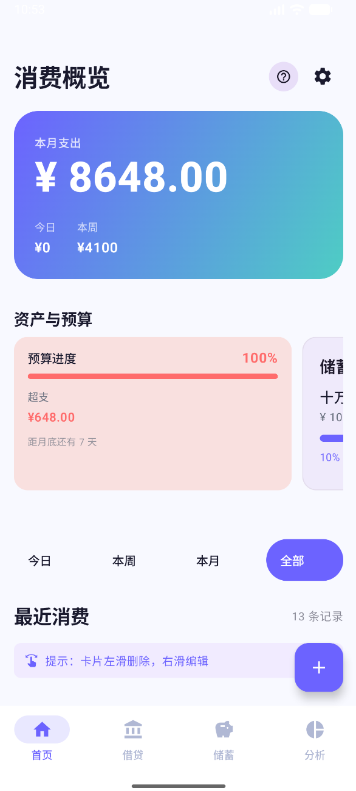
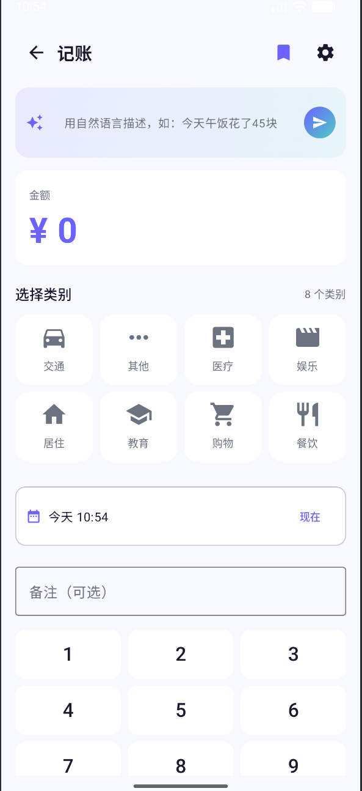
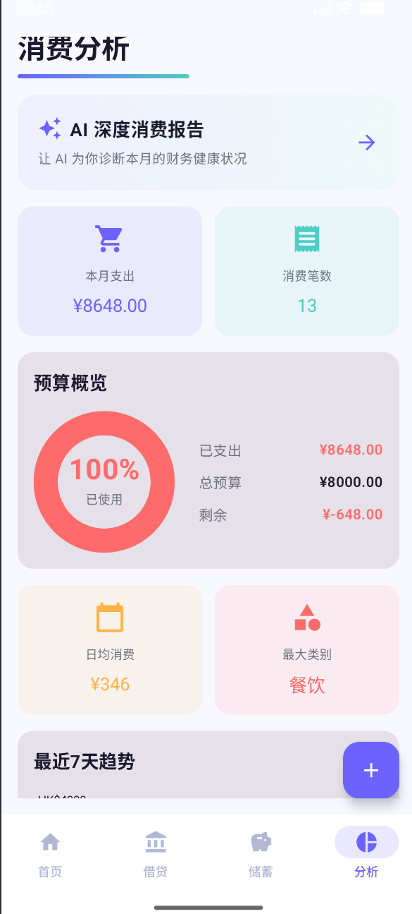
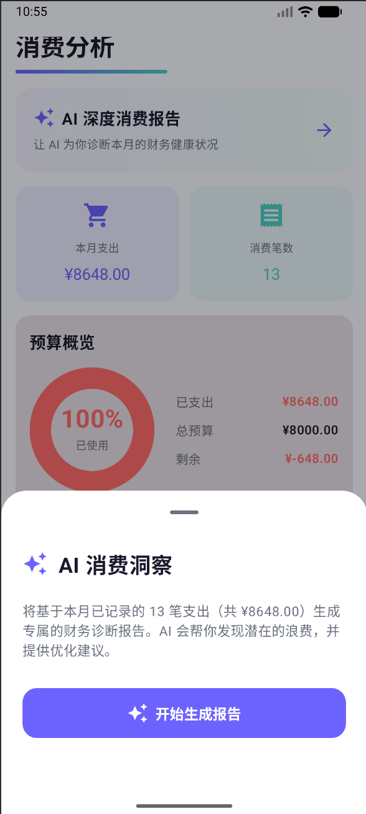
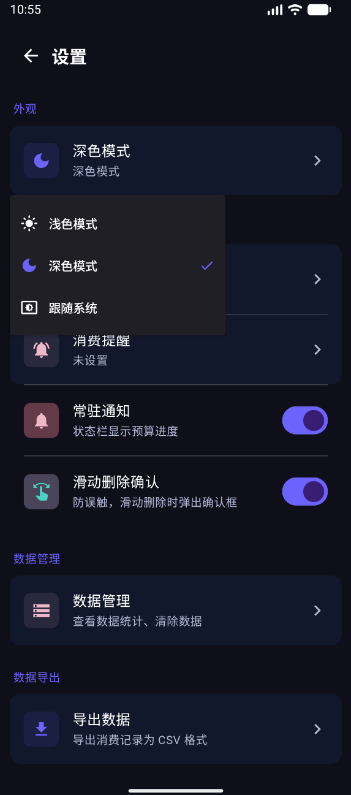
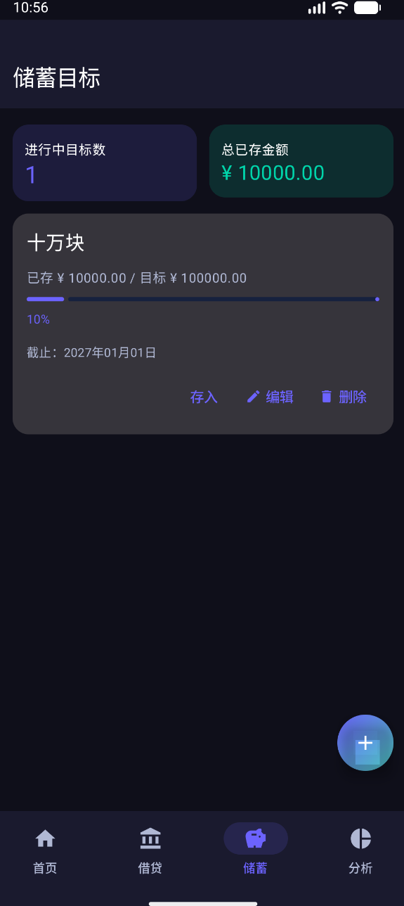

# 财务管家 (SmartSpend) 💰

A modern personal finance management Android app built with Kotlin and Jetpack Compose.

> **SEHH3326 Group Project **

---

## 📸 Screenshots

<!-- Add screenshots after taking them from the app -->
<!-- Suggested shots: Home page, Record page, Analysis page, AI report sheet, Dark mode -->

| Home | Record | Analysis |
|------|--------|----------|
|  |  |  |

| AI Report | Dark Mode | Saving Goals |
|-----------|-----------|--------------|
|  |  |  |

---

## ✨ Features

### Core
- **Expense Tracking** — Add, edit, and delete expense records with category, date, amount, and notes
- **Quick Templates** — Save frequent expenses as templates; pin up to 3 for one-tap recording
- **Natural Language Input** — Describe expenses in plain text (e.g. "lunch 45 bucks") and let AI fill in the form
- **Calculator Keyboard** — iOS-style number pad for fast amount entry

### Analysis
- **Monthly Overview** — Large hero card showing total monthly spend, today, and this week
- **Budget Tracking** — Set a monthly budget; progress bar and donut chart show usage in real time
- **7-Day Trend Chart** — Bar chart of daily spending over the past week
- **Category Breakdown** — Ranked list of spending by category with percentage bars
- **AI Deep Analysis** — DeepSeek-powered monthly report with insights and saving suggestions (requires backend)

### Asset Management
- **Debt Tracker** — Log money lent or borrowed, set due dates, mark as repaid
- **Saving Goals** — Set named goals with target amounts and deadlines, deposit progress manually
- **Stock Portfolio** — Track HK / US / A-share holdings with live price refresh (requires backend)

### UX & Customisation
- **Swipe Gestures** — Swipe left to delete, right to edit on expense items (with optional confirm dialog)
- **Dark Mode** — Full light / dark / system-follow support
- **Persistent Notification** — Status bar widget showing live budget progress
- **Budget Alerts** — Push notification at 80% and 100% budget usage
- **Data Export** — Export expense records to CSV (UTF-8, Excel compatible)
- **Category Management** — Add custom categories with icons or photos from your gallery
- **New User Onboarding** — Animated highlight overlay guiding first-time users

---

## 🛠️ Tech Stack

| Layer | Technology |
|-------|-----------|
| Language | Kotlin |
| UI | Jetpack Compose + Material Design 3 |
| Architecture | MVVM (ViewModel + Repository) |
| Local DB | Room (SQLite) |
| Preferences | DataStore |
| Charts | Vico Chart Library 2.0.0 |
| Image Loading | Coil |
| Backend | FastAPI (Python) |
| AI Model | qwen-plus via DashScope |
| Min SDK | Android 8.0 (API 26) |
| Target SDK | Android 14 (API 34) |

---

## 🚀 Getting Started

### Option A — Install the APK (Recommended for testers)

1. Download the latest APK from the [Releases](../../releases) page
2. On your Android device, go to **Settings → Security → Install unknown apps** and allow installation from your browser or file manager
3. Open the downloaded `.apk` file and tap **Install**
4. Launch **财务管家** from your home screen

> ⚠️ **AI features (natural language input & AI analysis) require the backend server to be running.** See the status note in the Releases section for the current backend URL. These features will show an error if the backend is offline — all other features work fully offline.

### Option B — Build from source

**Requirements:**
- Android Studio Hedgehog (2023.1.1) or later
- JDK 17+
- Android SDK with API 26–34

```bash
# Clone the repository
git clone https://github.com/pure-white189/financial-app.git
cd financial-app

# Open in Android Studio, let Gradle sync, then run on a device or emulator
```

---

## 🔧 Backend Setup (for AI features)

The backend is a lightweight FastAPI server that handles natural language expense parsing, AI monthly analysis, and stock price fetching.

### Prerequisites
- Python 3.10+
- A [DashScope](https://dashscope.aliyun.com/) API key (free tier available)

### Running locally

```bash
cd finance-backend

# Create and activate virtual environment
python -m venv venv
venv\Scripts\activate        # Windows
# source venv/bin/activate   # macOS / Linux

# Install dependencies
pip install fastapi uvicorn openai

# Set your API key (copy the example file and fill it in)
cp .env.example .env
# Edit .env and add: DASHSCOPE_API_KEY=your_key_here

# Start the server
uvicorn main:app --reload
# Server runs at http://127.0.0.1:8000
```

### Connecting the app to the backend

In `AiExpenseParser.kt`, update `BASE_URL`:

```kotlin
// Local emulator (default)
private const val BASE_URL = "http://10.0.2.2:8000"

// Local device on the same Wi-Fi (replace with your machine's IP)
private const val BASE_URL = "http://192.168.x.x:8000"

// Production (after cloud deployment)
private const val BASE_URL = "https://your-server-address"
```

> **Note:** `10.0.2.2` is the Android emulator's alias for the host machine's localhost. Physical devices on the same network need the actual local IP of the machine running the backend.

---

## 📁 Project Structure

```
app/src/main/java/com/example/myapplication/
├── data/
│   ├── AppDatabase.kt          # Room database (v6)
│   ├── Category.kt / CategoryDao.kt
│   ├── Expense.kt / ExpenseDao.kt
│   ├── ExpenseTemplate.kt / ExpenseTemplateDao.kt
│   ├── Loan.kt / LoanDao.kt
│   ├── SavingGoal.kt / SavingGoalDao.kt
│   ├── Stock.kt / StockDao.kt
│   ├── ExpenseRepository.kt
│   ├── ThemePreferences.kt     # DataStore settings
│   ├── NotificationHelper.kt
│   └── AiExpenseParser.kt      # Backend API client
│
├── ui/
│   ├── HomePage.kt
│   ├── RecordPage.kt
│   ├── AnalysisPage.kt
│   ├── DebtPage.kt
│   ├── SavingGoalPage.kt
│   ├── StockPage.kt
│   ├── SettingsPage.kt
│   ├── EditExpensePage.kt
│   ├── CategoryManagementPage.kt
│   ├── ExportPage.kt
│   └── components/
│       └── FeatureHighlightOverlay.kt
│
├── utils/
│   └── CsvExportHelper.kt
│
├── ExpenseViewModel.kt
├── MainActivity.kt
├── FinanceApplication.kt
├── BottomNavItem.kt
└── DateUtils.kt
```

---

## 📦 Database Schema

| Table | Version Added | Description |
|-------|--------------|-------------|
| `categories` | v1 | Expense categories (default + custom) |
| `expenses` | v1 | Individual expense records |
| `expense_templates` | v2 | Quick-record templates |
| `loans` | v4 | Debt / lending records |
| `saving_goals` | v5 | Savings targets with progress |
| `stocks` | v6 | Stock portfolio holdings |

> The database uses `fallbackToDestructiveMigration()` in this prototype — upgrading the app will clear all local data if the schema changes. This will be replaced with proper migrations before production release.

---

## ⚠️ Known Limitations

- **AI features require backend** — Natural language input and AI analysis will fail gracefully (show an error) if the backend is unreachable
- **Stock price refresh** — HK and US stocks fetch live prices from Yahoo Finance via the backend; A-share symbols (SS/SZ) should be entered without the suffix (e.g. enter `600519`, not `600519.SS`)
- **No cloud sync** — All data is stored locally; uninstalling the app will delete all records
- **Destructive migration** — Database schema changes between versions will wipe local data (prototype behaviour)

---

## 🗺️ Roadmap

- [ ] Cloud deployment of backend (Azure VM)
- [ ] User authentication (Firebase Auth)
- [ ] Cloud data sync
- [ ] Income / salary tracking with monthly reset
- [ ] Achievements & daily check-in system
- [ ] Subscription model for AI features
- [ ] Proper Room database migrations


---

## 📄 License

This project is for academic purposes only.
